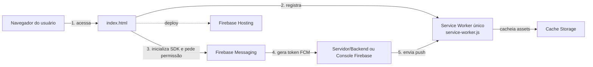
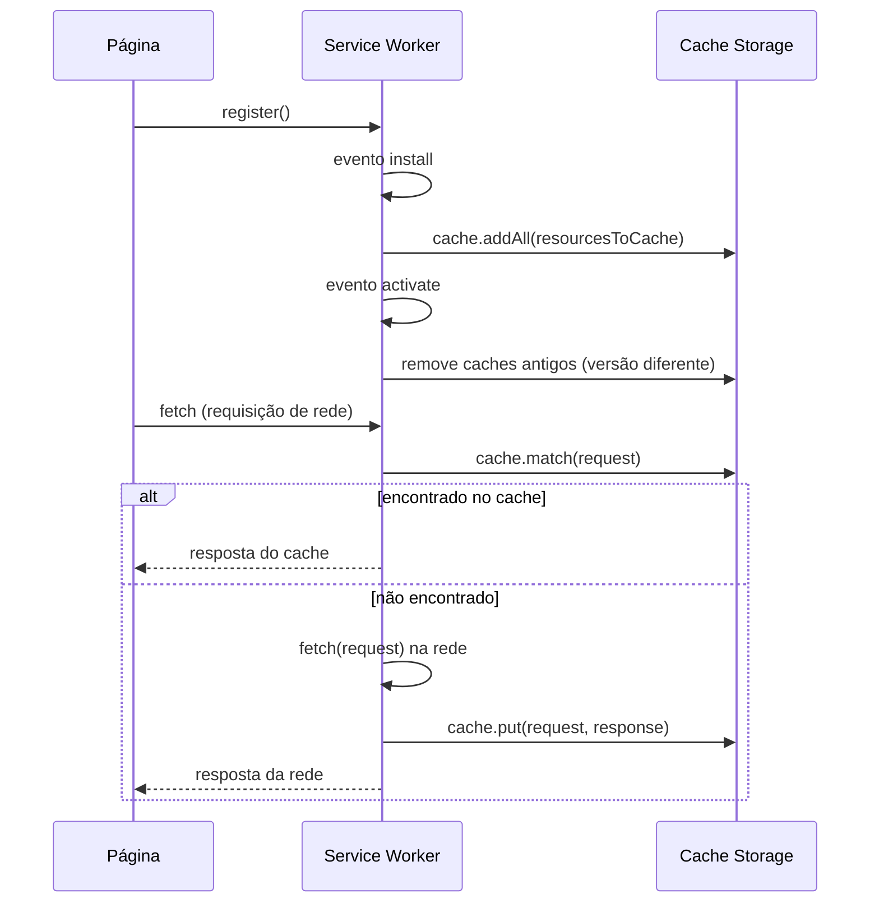
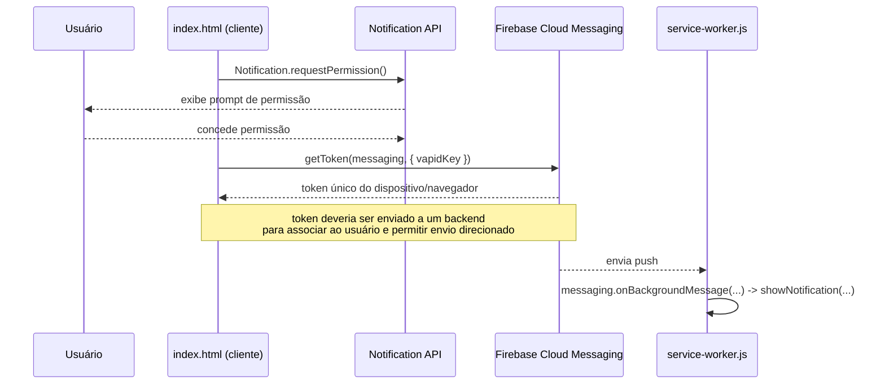

# Aula: PWA, Firebase Hosting e Notificações Push
### Estudo de caso: projeto DWTSP (Contato Direto pelo WhatsApp)

> Material de apoio para a disciplina **Desenvolvimento de Plataformas Móveis**
> Baseado no código real do projeto [dwtsp](../README.MD)

---

## 1. Visão geral da arquitetura

O projeto é uma aplicação web estática (HTML/CSS/JS puro, sem framework/bundler)
hospedada no **Firebase Hosting**, transformada em **PWA (Progressive Web App)**
com suporte a **notificações push via Firebase Cloud Messaging (FCM)**.



Peças principais do repositório:

| Arquivo | Papel |
|---|---|
| [public/index.html](../public/index.html) | Página principal, PWA + inicialização do Firebase (client-side) |
| [public/manifest.json](../public/manifest.json) | Manifesto do PWA (ícones, nome, cores, modo de exibição) |
| [public/scripts/main.js](../public/scripts/main.js) | Registra o Service Worker único |
| [public/service-worker.js](../public/service-worker.js) | Service Worker **único**: cache offline (install/fetch/activate) **+** notificações push em background (FCM) |
| [firebase.json](../firebase.json) | Configuração do Firebase Hosting |
| [package.json](../package.json) | Dependência do SDK `firebase` |

---

## 2. Configuração do Firebase

### 2.1 Firebase Hosting (`firebase.json`)

```json
{
  "hosting": {
    "site": "dwtsp",
    "public": "public",
    "ignore": ["firebase.json", "**/.*", "**/node_modules/**"],
    "rewrites": [{ "source": "**", "destination": "/index.html" }]
  }
}
```

Pontos:
- `"public": "public"` define a pasta que é publicada (equivalente ao `dist`/`build` de outros frameworks).
- `rewrites` com `"source": "**"` redireciona **todas** as rotas para `index.html` — padrão usado em SPAs para permitir rotas do lado do cliente.
- O deploy é feito com a CLI: `firebase deploy` (requer `firebase login` previamente).

### 2.2 SDK do Firebase no cliente (`index.html`)

O projeto usa o **Firebase JS SDK v10 (modular)**, importado via CDN com `type="module"`:

```js
import { initializeApp } from "https://www.gstatic.com/firebasejs/10.11.0/firebase-app.js";
import { getAnalytics } from "https://www.gstatic.com/firebasejs/10.11.0/firebase-analytics.js";
import { getMessaging, getToken } from "https://www.gstatic.com/firebasejs/10.11.0/firebase-messaging.js";

const firebaseConfig = {
  apiKey: "...",
  authDomain: "services-sandroaf.firebaseapp.com",
  projectId: "services-sandroaf",
  storageBucket: "services-sandroaf.appspot.com",
  messagingSenderId: "8530075618",
  appId: "1:8530075618:web:476219e15e278d98d2a3bb",
  measurementId: "G-STZ7LQHZK3"
};

const app = initializeApp(firebaseConfig);
const analytics = getAnalytics(app);
const messaging = getMessaging(app);
```

Ponto importante para discutir com os alunos: o `firebaseConfig` (incluindo `apiKey`) **não é um segredo** — ele identifica o projeto, não autentica requisições. A segurança real vem das **regras de segurança** (Firestore/Storage) e da configuração de domínios autorizados no console. Mesmo assim, é uma boa prática **não versionar chaves como a VAPID key diretamente no código-fonte de produção**; aqui está hardcoded para fins didáticos.

---

## 3. PWA — `manifest.json`

O manifesto é o que permite "instalar" a aplicação como um app nativo:

```json
{
  "name": "dwtsp.web.app",
  "short_name": "dwtsp",
  "start_url": ".",
  "display": "minimal-ui",
  "background_color": "#999",
  "theme_color": "#f2f2f2",
  "icons": [ /* vários tamanhos para Android, iOS e Windows 11 */ ]
}
```

Conceitos-chave:
- **`display`**: controla o "chrome" do navegador ao abrir o app instalado (`standalone`, `minimal-ui`, `fullscreen`, `browser`).
- **`start_url`**: página inicial quando o app é aberto a partir do ícone instalado.
- **`icons`**: múltiplos tamanhos/propósitos (`any` vs `maskable`) — necessário por causa das diferenças entre Android (ícones adaptativos), iOS e Windows (Tiles do Windows 11).
- O manifesto é referenciado no `<head>` do HTML: `<link rel="manifest" href="/manifest.json">`.
- Meta tags complementares usadas no `index.html`: `theme-color`, `apple-mobile-web-app-capable`, `apple-mobile-web-app-title` — cobrem particularidades do Safari/iOS, que não segue 100% o manifest.json.

Ferramenta útil: aba **Application > Manifest** do DevTools do Chrome, e o critério de "instalabilidade" (installability criteria).

---

## 4. Service Worker único: cache offline + push (`service-worker.js`)

### 4.1 Registro (`main.js`)

```js
if ('serviceWorker' in navigator) {
  window.addEventListener('load', () => {
    navigator.serviceWorker.register('/service-worker.js')
      .then((registration) => console.log('Service Worker registrado:', registration))
      .catch((error) => console.error('Falha ao registrar o Service Worker:', error));
  });
}
```

- Feature detection (`'serviceWorker' in navigator`) antes de tentar registrar.
- Registro dentro do evento `load` para não atrasar o carregamento inicial da página.
- Service Workers só funcionam em contexto seguro (HTTPS ou `localhost`).
- **O arquivo fica na raiz de `public/` (`/service-worker.js`), não em `/scripts/`.** O escopo padrão de um Service Worker é limitado ao diretório onde o script está — um SW em `/scripts/service-worker.js` só controlaria requisições sob `/scripts/`, nunca a navegação para `/` ou `/index.html`. Esse foi exatamente um bug real encontrado neste projeto: o fallback offline nunca era acionado na navegação porque o SW estava fora de escopo, e o navegador exibia sua página padrão (o "dino do Chrome") em vez do `offline.html`.

### 4.2 Ciclo de vida: `install` → `activate` → `fetch`



- **`install`**: pré-cacheia uma lista de assets estáticos (`resourcesToCache`) usando `caches.open(cacheName).addAll(...)`. Estratégia conhecida como **"cache the app shell"**.
- **`activate`**: limpa caches de versões antigas comparando o nome (`cacheName = 'meuAppCache-v3'`) — importante para **versionamento de cache** (mudar o nome força atualização).
- **`fetch`**: estratégia **"Cache First, fallback to Network"** — tenta responder do cache; se não encontrar, busca na rede e grava no cache para a próxima vez. Em caso de falha total (offline), cai no fallback: página `offline.html` para navegação, imagem padrão para `image`, ou uma resposta 503 textual.
- **`skipWaiting()`**: chamado ao final do `install`, faz o novo Service Worker assumir o controle imediatamente, sem esperar todas as abas antigas fecharem.

---

## 5. Notificações Push com Firebase Cloud Messaging (FCM)

O mesmo `service-worker.js` também atua como Service Worker do FCM — não há mais um segundo arquivo dedicado (o antigo `firebase-messaging-sw.js` foi removido).

### 5.1 Passo a passo do fluxo Push



### 5.2 Solicitação de permissão e obtenção do token (client-side, em `index.html`)

```js
Notification.requestPermission().then((permission) => {
  if (permission === 'granted') {
    getToken(messaging, { vapidKey: 'BDul1owA-...' })
      .then((token) => console.log('Token FCM:', token))
      .catch((err) => console.error('Erro ao obter token:', err));
  } else {
    console.log('Permissão de notificação negada');
  }
});
```

- A **VAPID key** (Voluntary Application Server Identification) é a chave pública que identifica o remetente autorizado a enviar push para esse projeto — gerada no console do Firebase (Project Settings > Cloud Messaging > Web Push certificates).
- O `token` retornado identifica **este navegador/dispositivo específico**. Em uma aplicação real, esse token deve ser enviado para um backend e persistido (associado ao usuário) para permitir o envio de notificações direcionadas.

### 5.3 Recebimento em background (`service-worker.js`)

```js
importScripts('https://www.gstatic.com/firebasejs/10.11.0/firebase-app-compat.js');
importScripts('https://www.gstatic.com/firebasejs/10.11.0/firebase-messaging-compat.js');

firebase.initializeApp(firebaseConfig);
const messaging = firebase.messaging();

messaging.onBackgroundMessage(function(payload) {
  self.registration.showNotification(payload.notification.title, {
    body: payload.notification.body,
    icon: payload.notification.icon
  });
});
```

- Usa a **versão "compat"** do SDK (API global `firebase.*`) via `importScripts`, porque Service Workers registrados sem `{ type: 'module' }` são scripts clássicos e não suportam `import` de módulos ES — usar as versões não-compat (`firebase-app.js`/`firebase-messaging.js`) aqui quebra a avaliação inteira do Service Worker.
- `messaging.onBackgroundMessage(...)` é o hook de alto nível do SDK compat para tratar mensagens FCM recebidas em background — dispensa um listener manual de `push`.
- Como agora é o **mesmo arquivo** que cuida do cache, o registro em `main.js` (`/service-worker.js`, na raiz) já é suficiente; não é mais necessário registrar um segundo Service Worker.

---

## 6. Pontos de atenção

debate/exercício com base neste projeto real:

1. **Um único Service Worker**: o projeto já teve dois arquivos (`service-worker.js` para cache e `firebase-messaging-sw.js` para FCM), mas o segundo nunca chegou a ser registrado em lugar nenhum do código — era um arquivo órfão. A arquitetura foi unificada em `service-worker.js`, na **raiz** de `public/`. Pergunta para a turma: quais as vantagens/desvantagens de um único SW versus dois SWs com escopos diferentes?
2. **Módulos ES vs scripts clássicos em Service Workers**: `importScripts` só carrega scripts clássicos; usar os builds modulares (`firebase-app.js`/`firebase-messaging.js`, sem `-compat`) faz a avaliação do SW falhar silenciosamente no console (`Uncaught NetworkError` / `ServiceWorker script evaluation failed`). Por que isso é fácil de passar despercebido em testes locais?
3. **`index_firebase.html`** é o template padrão gerado pelo `firebase init hosting` e não está integrado ao app — bom exemplo de "boilerplate esquecido" para mostrar como identificar código morto num projeto real.
4. **Fallback de offline**: testar desligando a rede no DevTools (`Application > Service Workers > Offline`) e observar `offline.html` sendo servido.
5. **Segurança**: diferenciar o que é "chave pública/identificador" (apiKey, VAPID key) do que precisa ser protegido no backend (nunca existe neste projeto porque tudo é client-side).
6. **Ciclo de atualização do Service Worker**: mostrar como o navegador detecta um novo `service-worker.js` (byte a byte) e o fluxo *waiting → skipWaiting → activate*.

---
